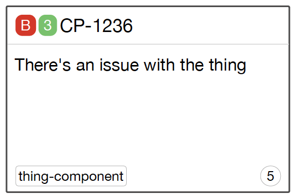

[![Build Status][circleci-image]][circleci-url]
[![Code Coverage][coverage-image]][coverage-url]
[![Code Climate][climate-image]][climate-url]
[![Codecov status][codecov-image]][codecov-url]
[![bitHound Overall Score][bithound-overall-image]][bithound-url]
[![bitHound Dependencies][bithound-deps-image]][bithound-deps-url]
[![Dependency Status][gemnasium-image]][gemnasium-url]
[![Current Version][npm-image]][npm-url]
[![JS Standard Style][js-standard-image]][js-standard-url]
[![CII Best Practices][cii-bp-image]][cii-bp-url]

# jiraprinter

> _As a JIRA user, I want to be able to print out my current sprint's stories,
so that I can post them on a physical Kanban board._



## Background

While JIRA has a UI for tracking and interacting with the current sprint's stories, teams easily become distracted while using it together &mdash; the group ends up huddled around a laptop arguing about the best way to filter the search query, or getting lost in unimportant details. Sometimes low-tech solutions can be the most powerful: physical cards representing the stories.

This is a very simple app that queries JIRA to list all of the stories in the team's current sprint, and provide an HTML page with print-optimized CSS rules.

Each story is printed out as a half-page (US Letter) card, with the Story number, the summary, and the priority. As a bonus, a QR code is provided which will take you directly to the story from your smartphone.

## Usage

### with Docker

You can run jiraprinter in Docker:

```console
$ docker run -d -p 8080:80 -e JIRA_PASS -e JIRA_USER=me -e JIRA_HOST=myjira.example.com hairyhenderson/jiraprinter
```

Or, you can use `npm` to install it:

### install

```console
$ npm install -g jiraprinter
```

### run it!

```console
$ jiraprinter --help

  Usage: jiraprinter [options]

  Options:

    -h, --help                                  output usage information
    -V, --version                               output the version number
    -u, --user [username]                       The JIRA username ($JIRA_USER)
    --password [password]                       The JIRA password ($JIRA_PASS)
    -h, --host [host]                           The JIRA hostname ($JIRA_HOST)
    --printQR [printQR]                         Whether to include an issue link QR code in the print out ($PRINT_QR) - defaults to true
    -f, --fieldOverrides [fieldOverrides]       Comma (,) seperated list of fields to replace with custom field names (e.g. "-f estimation:fields.customfield_1,name:fields.custom_field2")
    --boardName [boardName]                     Filter boards by name
$ jiraprinter -h myjira.example.com -u me
```

_You should probably only ever use `$JIRA_PASS`, and not the `--password` flag!_

Now, connect with your browser at http://localhost:3000, select your board, and when the UI's fully populated with your stories, print the page!

## License

[The MIT License](http://opensource.org/licenses/MIT)

Copyright (c) 2015 Dave Henderson

[circleci-image]: https://img.shields.io/circleci/project/hairyhenderson/jiraprinter.svg?style=flat
[circleci-url]: https://circleci.com/gh/hairyhenderson/jiraprinter

[coverage-image]: https://img.shields.io/codeclimate/coverage/github/hairyhenderson/jiraprinter.svg?style=flat
[coverage-url]: https://codeclimate.com/github/hairyhenderson/jiraprinter

[climate-image]: https://img.shields.io/codeclimate/github/hairyhenderson/jiraprinter.svg?style=flat
[climate-url]: https://codeclimate.com/github/hairyhenderson/jiraprinter

[gemnasium-image]: https://img.shields.io/gemnasium/hairyhenderson/jiraprinter.svg?style=flat
[gemnasium-url]: https://gemnasium.com/hairyhenderson/jiraprinter

[npm-image]: https://img.shields.io/npm/v/jiraprinter.svg?style=flat
[npm-url]: https://npmjs.org/package/jiraprinter

[waffle-ready-image]: https://badge.waffle.io/hairyhenderson/jiraprinter.svg?label=ready&title=Ready
[waffle-progress-image]: https://badge.waffle.io/hairyhenderson/jiraprinter.svg?label=in+progress&title=In+Progress
[waffle-url]: https://waffle.io/hairyhenderson/jiraprinter

[js-standard-image]: https://img.shields.io/badge/code%20style-standard-brightgreen.svg?style=flat
[js-standard-url]: http://standardjs.com/

[bithound-overall-image]: https://www.bithound.io/github/hairyhenderson/jiraprinter/badges/score.svg
[bithound-url]: https://www.bithound.io/github/hairyhenderson/jiraprinter

[bithound-deps-image]: https://www.bithound.io/github/hairyhenderson/jiraprinter/badges/dependencies.svg
[bithound-deps-url]: https://www.bithound.io/github/hairyhenderson/jiraprinter/master/dependencies/npm

[codecov-image]: https://img.shields.io/codecov/c/github/hairyhenderson/jiraprinter.svg
[codecov-url]: https://codecov.io/gh/hairyhenderson/jiraprinter

[cii-bp-image]: https://bestpractices.coreinfrastructure.org/projects/338/badge
[cii-bp-url]: https://bestpractices.coreinfrastructure.org/projects/338
